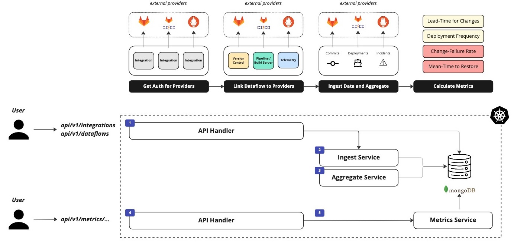
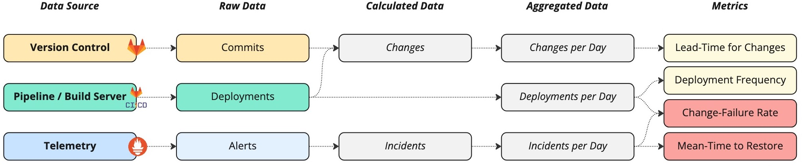

# dora - fully automated DORA metrics

> **Note**
> This repository was created for the Master Thesis titled "Automated DORA Metrics: A Case Study" at FHNW, Switzerland.
> Currently, we only provide the backend to calculate DORA metrics based on DevOps tooling data.
> However, all metrics can be computed using our API.

`dora` provides a backend to track the four DORA metrics in a completely automated manner. Thus, we provide the following metrics:

- Deployment Frequency (DF)
- Lead-Time for Changes (LTFC)
- Change-Failure Rate (CFR)
- Mean-Time to Restore (MTTR)

We currently support the following DevOps integrations:

- Version Control: **Gitlab**
- CICD: **Gitlab CICD**
- Telemetry: **Prometheus**

If you're interested to use it for your team, but need us to support different DevOps technologies, please feel free to create a ticket and tell us!

## Requirements

If you want to run `dora` locally, we assume you meet the following requirements installed:

- Go >1.20
- Docker

## Overview

A typical workflow using `dora` to calculate the DORA metrics is visualized below.



The implemented concepts to compute the DORA metrics are also visualized below.



## Development

During development, we suggest you using the `docker-compose` configuration given in this repository.

However, if you want to use `kind`, we suggest using the following configuration when creating a new cluster:

```yaml
apiVersion: kind.x-k8s.io/v1alpha4
kind: Cluster
nodes:
- role: control-plane
  extraPortMappings:
  - containerPort: 32042
    hostPort: 32042
- role: worker
```

## Run it

You can run `dora` using just a few commands!

To run `dora` locally, first populate the `.env`:

```bash
make copy-empty-env
```

Inside the `.env` you only need to add a bearer-token for Gitlab to `GITLAB_BEARER`.

> **Warning**
> For production purposes, please ennsure that you use different credentials as the once proposed for a local test environment!

Next, build and run the backend alongside a MongoDB instance:

```bash
make compose
```

Inspect the data in MongoDB:

```bash
make mongo-sh
```

If you need to start and stop the MongoDB manually:

```bash
make mongo-run
make mongo-stop
```

### Test it

If you want to run the tests one by one, you can use:

```bash
make mongo-run
```

This creates a new MongoDB instance within a Docker container, so that you can run the integration tests against a database.

However, if you want to run all test, just use:

```bash
make tests
```

This command creates a temporary MongoDB instance, runs all test and destroys the instance afterwards.

## License

`dora` is an open-source project. Please check the [license](./LICENSE) for more information.

## Additional Sources

You can find more information on the DORA metrics here:

- [DORA Accelerate State of DevOps Report - 2022](https://cloud.google.com/blog/products/devops-sre/dora-2022-accelerate-state-of-devops-report-now-out)
- [Google Cloud Platform - Four Key Metrics](https://github.com/GoogleCloudPlatform/fourkeys)
- [Accelerate: The Science Behind DevOps](https://books.google.ch/books/about/Accelerate.html?id=85XHAQAACAAJ)
