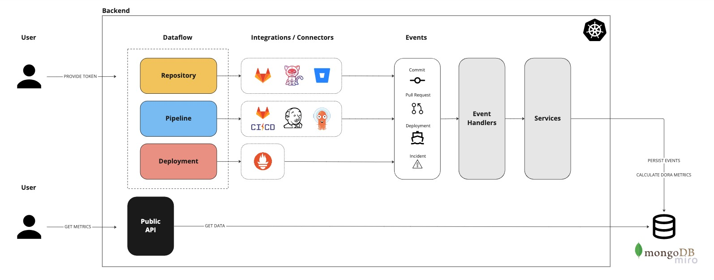

# dora - fully automated DORA metrics

> **Note**
> This respository is work-in-progress. It's core functionality is not finished yet, but will be in **March 2023**.

`dora` provides a backend to track the five DORA metrics in a completely automated manner. If you're interested to use it for your organization, but you need us to support additional DevOps technologies, please feel free to create a ticket and tell us!

## Overview

The backend for `dora` visualized below.



> **Note**
> It currently supports only Gitlab, Gitlab CI. Prometheus, Bitbucket, Tekton, Argo and Jenkins will follow.

## Requirements

If you want to run `dora` locally, we assume you meet the following requirements installed:

* Go >1.19
* Docker

## Setup

> **Note**
> `dora` can only be run locally - a Kubernetes integration and Helm charts will be added before **March 2023**.

### Run

If you want to run `dora` locally, you can do so using:

```bash
make copy-empty-env
```

Inside the `.env` you only need to add a bearer-token for Gitlab to `GITLAB_BEARER`.

> **Warning**
> For production purposes, please ennsure that you use different credentials as the once proposed for a local test environment!

This builds and run the backend, alongside a MongoDB instance running in Docker using:

```bash
make compose
```

### Test

If you want to run seperate local test, you can use:

```bash
make mongo-run
```

This creates a new MongoDB instance within a Docker container.

To run all test, including integration, you can use:

```bash
make tests
```

This command creates a temporary MongoDB instance, runs all test and destroys the MongoDB instance afterwards.

## License

`dora` is an open-source project. Please check the [license](./LICENSE) for more information.

## Additional Sources

You can find more information on the DORA metrics here:

- [DORA Accelerate State of DevOps Report - 2022](https://cloud.google.com/blog/products/devops-sre/dora-2022-accelerate-state-of-devops-report-now-out)
- [Google Cloud Platform - Four Key Metrics](https://github.com/GoogleCloudPlatform/fourkeys)
- [Accelerate: The Science Behind DevOps](https://books.google.ch/books/about/Accelerate.html?id=85XHAQAACAAJ)